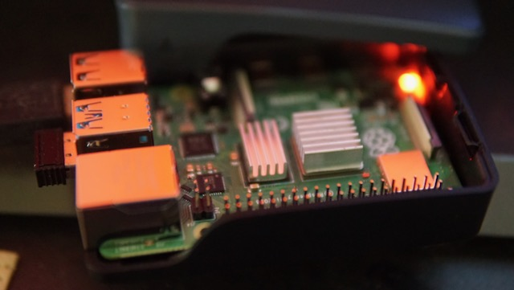
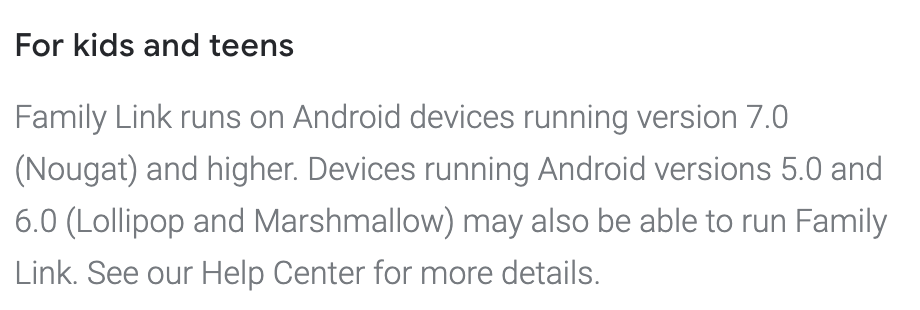

I wanted to help my son to manage his time better, expose him on technology and let him discover anything related to tech
himself in a controlled environment. I have a few options, but ultimately, I am experimenting with Raspberry PI setup
first. This post is to share my considered options and the challenges I faced. 

## Considered Options

There are a lot of options out there. I am trying to stick to my goal at manageable cost. If any of the setups above
does not work out well, I also want to plan for alternative plans.

1. iPad
    - Price range: RM 1500 - RM 2000
    - Given the price range, I'd expect total cost of ownership will be excellent throughout the years. I have been a
      very happy Apple customer with their excellent support.
    - It would work well with my existing Apple ecosystem (iCloud especially).
    - Conducive for learning with lots of apps and services.
    - Yet if not well managed, can be quite a distraction for the kids.
    - Honorable mentions:
        - [Google Classroom](https://apps.apple.com/us/app/google-classroom/id924620788)
        - [Swift Playground](https://www.apple.com/swift/playgrounds/) - My son is already doing this on my Macbook.
        - All the things that I already like: [Airmail](https://airmailapp.com/), [Fantastical](https://flexibits.com/fantastical) and [1Password](https://1password.com/). 
    
2. Raspberry PI setup as PC
    - Price range: RM 600 - RM 800 (Raspberry PI kit and a monitor) 
    - I prefer PC setup for learning, than tablet.
    - Practically, I expect this to serve as "dump terminal" that leverages cloud services. 
    - It is not x86 arch (arm-based running on linux), meaning I need to be prepared to do workarounds.
    - If things doesn't work out, probably I can use it for IoT purpose to my house or any other fun project?
    - For the most of things, I'll be relying on the Raspberry PI communities, not supported by a particular vendor.
    
3. Actual PC
    - Price range: More than RM 3000 (for a decent machine)
    - If money is not a problem, this is the best option, but also the most expensive.
    - While you can get cheaper machine, I think the law of diminishing returns applies here. My advice, if you can
      afford to get a well designed machine from a trusted vendor, do that. My mid-2012 MBPr is still running till now.
      My sister just replaced the battery and it runs pretty well. 
    - I still like Mac OS, I was looking at Macbook variants, but seems too expensive for this purpose alone.
    - Linux/Windows options from [Illegear](https://www.illegear.com/) looks quite decent.
    - My son has been using my Macbook to build his own games in Roblox. Looks like a fun activity to get him exposed
      more on tech in general. So, if he's learning to code in Swift, it might not be hard to do simple Lua later.

## Raspberry PI Setup: An Explanation

### Buying the Hardwares and Making It Run

In order to replicate a typical PC setup, I ordered these from lazada. Note: I already have keyboard + mouse.

Just to keep it run with sensible defaults, these are what I did:

- They ship with older version of [NOOBS](https://www.raspberrypi.org/downloads/noobs/), thus I have prepared the
  micro SD card with the latest version.
- I decided to keep it simple and use [Raspbian](https://www.raspberrypi.org/documentation/raspbian/) because this is 
  for general purpose machine and I want to spend least time tinkering.
- I need full access (at least in local network) and thus I want my sensible terminal/shell setup. I provisioned these
  simple setup at [github.com/faizhasim/starters-raspberry](https://github.com/faizhasim/starters-raspberry).

### Problem 1: Google Family Link Does Not Work

I configured a child google account for my son and it works well enough on multi-user setup on my Macbook. Minimally, it
serves the purpose without spending too much money and effort. My son has a working email gmail account, a calendar that
is shared to mine and additionally managed youtube account. All of these can be managed from the
[Google Family Link](https://apps.apple.com/us/app/google-family-link-for-parents/id1150085200) app.

I thought it will work on Raspberry PI, given that it work on my Mac, but Google says this...

In other words, for Linux distro, perhaps it is impossible to enforce this anyway. Perhaps, Google is bound to legal
implications but, it would be nice if they can ask parent's permission to override this and allow full access. Regardless,
I still can't fix this. There might be 3 possible options:

#### Install ChromeOS on Raspberry PI

- There is a post on how to install Chromium OS at [Chromium OS on Raspberry Pi 4 Installation and Working](https://pcmac.biz/chromium-os-on-raspberry-pi-4/).
- If this works, I wonder if Family Link works too?
- This is not officially supported by Google, so there is always chances that this will not work tomorrow.

#### Don't use Family Link

- Self-explanatory.
- I can't control as easily.

#### Private Mail Server

- There are subscription-based services like Office 365 and GSuite (maybe Apple iCloud too?). But, that would
  fixed expense for me. I do not think the value for us is worth the price. If you're reading this and know any good
  services for kids, do let me know. 
- Another possible solution is to self-managed. Perhaps, using [DSM MailServer](https://www.synology.com/en-my/dsm/packages/MailServer).
  I will not recommend this for business requirements, but I wonder if this is ok for my family usage?
  
### Problem 2: Lack of Native Apps

- Not really a problem. But, this is something that I'm aware of and I'm willing to experiment.
- Effectively, majority of the apps/services must be cloud first.
- The idea of running ChromeOS does sound interesting.

## Last words...

The journey is still early. I am not too surprised if this doesn't work well, but I'm happy to see how far I can go.
If it doesn't work well, maybe the raspberry pi can be used to turn on the heater unit in the morning for a nice warm shower.  

