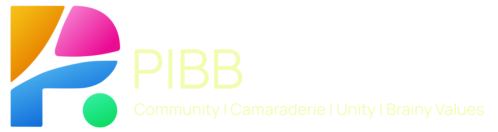
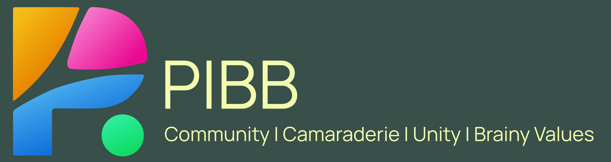
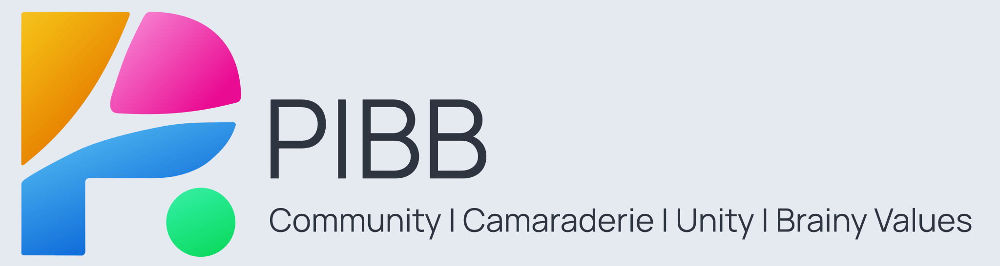

---

| <figure><figcaption>Logo without Text – Transparent 1</figcaption></figure> |
|-----------------------------------------------------------------------------------------------------------------------------------------------------------------|

| <figure><figcaption>Logo - Dark - Variant A</figcaption></figure> | <figure><figcaption>Logo - Dark - Variant B</figcaption></figure> | <figure><figcaption>Logo - Light - Variant A</figcaption></figure> |
|----------------------------------------------------------------------------------------------------------------------------------------------------------------------|------------------------------------------------------------------------------------------------------------------------------------------------------------------------------|-------------------------------------------------------------------------------------------------------------------------------------------------------------------------|

---

<figure>
  
  <figcaption>Full Logo – Dark Theme - Transparent</figcaption>
</figure>

<figure>
  
  <figcaption>Full Logo – Light Theme - Transparent</figcaption>
</figure>

<figure>
  
  <figcaption>Full Logo – Dark Theme - Transparent</figcaption>
</figure>
<figure>
  
  <figcaption>Full Logo – Dark Theme - Variant A</figcaption>
</figure>

<figure>
  
  <figcaption>Full Logo – Dark Theme - Variant B</figcaption>
</figure>

<figure>
  
  <figcaption>Full Logo – Light Theme - Variant A</figcaption>
</figure>

---

> Download all logo assets: [pibb-logo-assets.zip](https://gist.github.com/faizhasim/0f527b36b5d78b6855e7b4ce54bb6b89/raw/0e6be77f25e39026801905a4bf1e3db7d00a0b42/pibb-logo-assets.zip)
